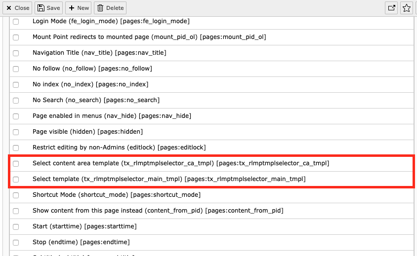

.. include:: ../Includes.rst.txt

.. _admin-manual:

Administrator manual
====================

Like any other field which appears in the page content form, you also can restrict access for
the template selector by using the access lists of the backend user groups. Just enable the
`main template selector` and the `content area selector` for those BE usergroups who need to work with them:

